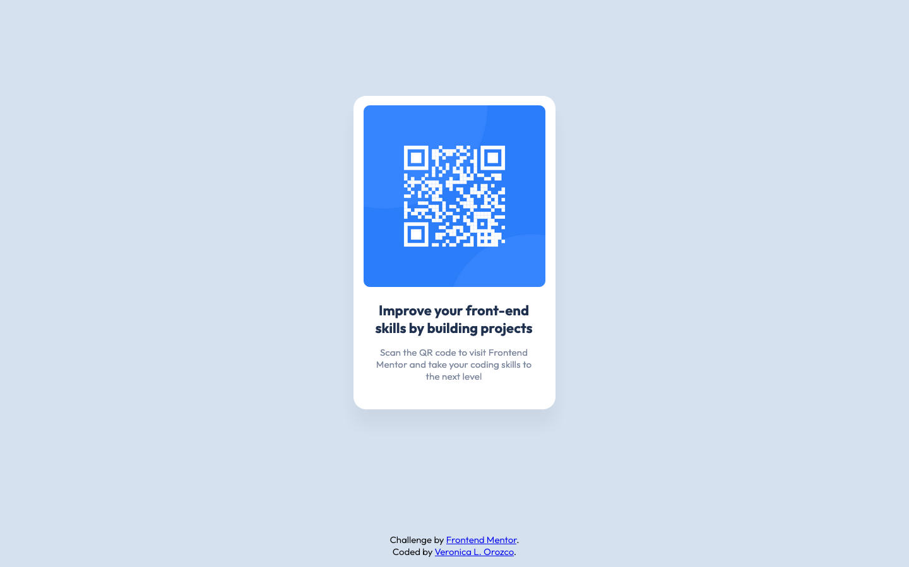

# Frontend Mentor - QR code component solution

This is a solution to the [QR code component challenge on Frontend Mentor](https://www.frontendmentor.io/challenges/qr-code-component-iux_sIO_H). Frontend Mentor challenges help you improve your coding skills by building realistic projects. 

## Table of contents

- [Frontend Mentor - QR code component solution](#frontend-mentor---qr-code-component-solution)
  - [Table of contents](#table-of-contents)
  - [Overview](#overview)
    - [Screenshot](#screenshot)
    - [Links](#links)
    - [Built with](#built-with)
  - [Author](#author)

---
## Overview

### Screenshot

### Links

- Solution URL: [Github Code](https://github.com/VLOrozco/qr-code-component.git)
- Live Site URL: [qr-code-component](https://vlorozco.github.io/qr-code-component/)

### Built with

- HTML5
- CSS
- Flexbox
- Mobile-first workflow

---
## Author

- Github - [Veronica L. Orozco](https://github.com/VLOrozco)
- Frontend Mentor - [@VLOrozco](https://www.frontendmentor.io/profile/VLOrozco)
- Codecademy - [orozcov3](https://www.codecademy.com/profiles/orozcoV3)

